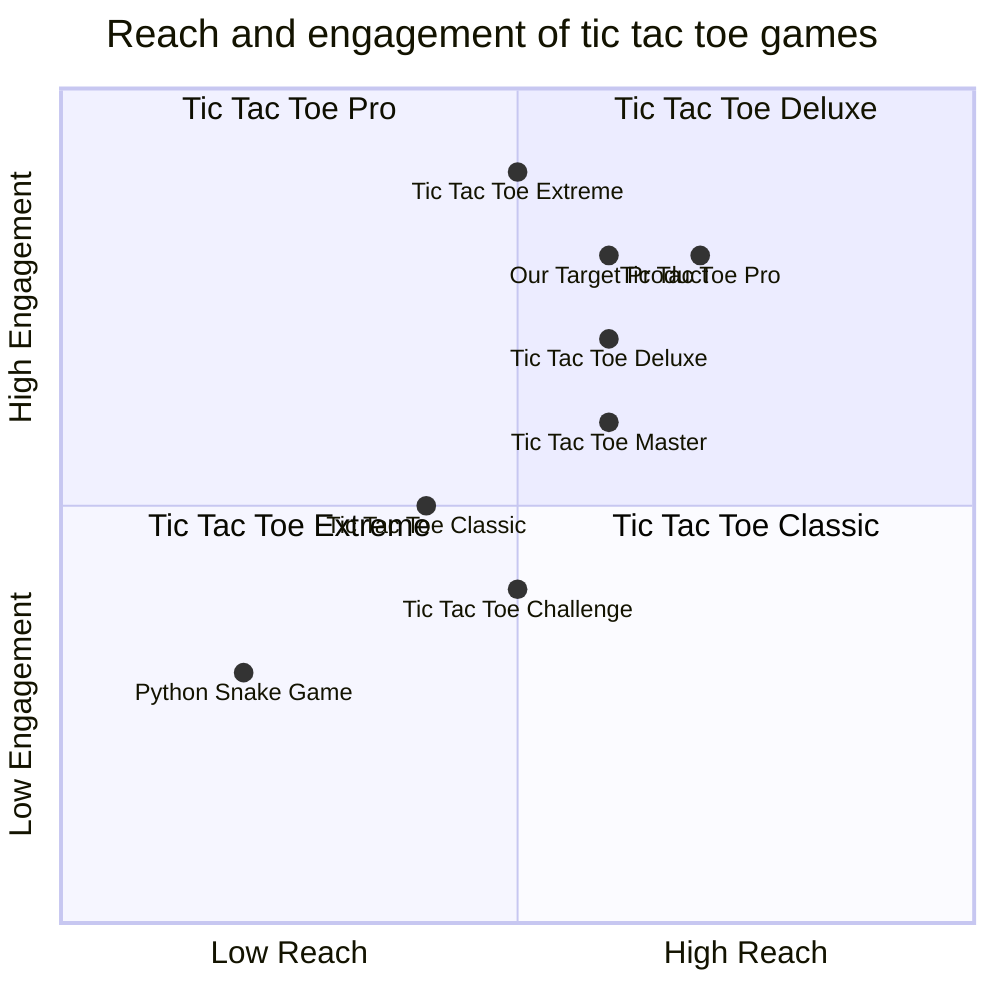

## Original Requirements:
The boss wants you to create a simple tic tac toe game using pygame.

## Product Goals:
- Create a user-friendly and visually appealing tic tac toe game.
- Provide a smooth and enjoyable gaming experience.
- Implement intelligent AI for single-player mode.

## User Stories:
- As a player, I want to be able to start a new game.
- As a player, I want to be able to play against the computer in single-player mode.
- As a player, I want to be able to play against another player in two-player mode.
- As a player, I want to be able to see the current state of the game and the winner.
- As a player, I want to be able to restart the game after it ends.

## Competitive Analysis:
- Python Snake Game: A popular game with simple graphics and easy gameplay.
- Tic Tac Toe Deluxe: A tic tac toe game with various themes and difficulty levels.
- Tic Tac Toe Pro: A tic tac toe game with a sleek design and multiplayer mode.
- Tic Tac Toe Extreme: A tic tac toe game with challenging AI and customizable settings.
- Tic Tac Toe Classic: A simple tic tac toe game with a minimalist design.
- Tic Tac Toe Master: A tic tac toe game with different board sizes and AI difficulties.
- Tic Tac Toe Challenge: A tic tac toe game with a time-based challenge mode.

## Competitive Quadrant Chart:


## Requirement Analysis:
The product should be a tic tac toe game implemented using pygame. It should have a user-friendly interface and support both single-player and two-player modes. The game should display the current state of the game and the winner. It should also allow the players to restart the game after it ends.

## Requirement Pool:
```python
[
    ("Implement the tic tac toe game logic", "P0"),
    ("Create the game interface using pygame", "P0"),
    ("Implement the single-player mode with intelligent AI", "P1"),
    ("Implement the two-player mode", "P1"),
    ("Display the current state of the game and the winner", "P2")
]
```

## UI Design draft:
The game interface should have a 3x3 grid representing the tic tac toe board. Each cell of the grid should be clickable and display the player's symbol (X or O) when clicked. The current state of the game and the winner should be displayed at the top of the interface. There should be a "New Game" button to start a new game and a "Restart" button to restart the game after it ends. The interface should have a clean and modern design with visually appealing graphics and animations.

## Anything UNCLEAR:
There are no unclear points.