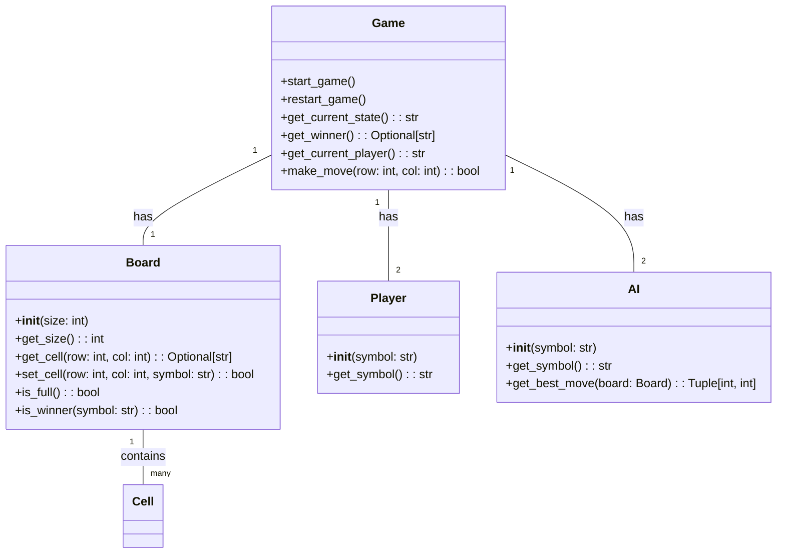
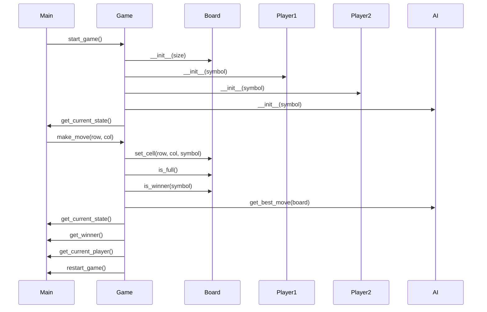

## Implementation approach:
For the tic tac toe game, we will use the pygame library to create the game interface and handle user input. We will implement the game logic using a simple class-based approach. To provide intelligent AI for single-player mode, we will use the minimax algorithm. 

## Python package name:
```python
"tic_tac_toe_game"
```

## File list:
```python
[
    "main.py",
    "game.py",
    "board.py",
    "player.py",
    "ai.py"
]
```

## Data structures and interface definitions:


## Program call flow:


## Anything UNCLEAR:
The requirement is clear to me.