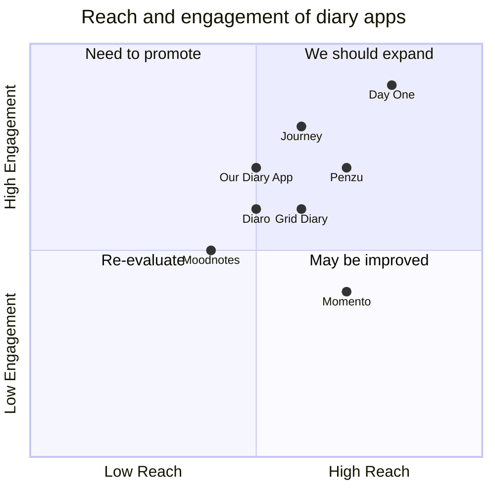

## Original Requirements:
The boss wants to create a simple diary app. After every 3 requests on the model, the app should wait for one minute before processing the next request.

## Product Goals:
- Create a simple and user-friendly diary app.
- Ensure efficient processing of requests.
- Provide a seamless user experience.

## User Stories:
- As a user, I want to be able to easily create and save diary entries.
- As a user, I want to be able to view and edit my diary entries.
- As a user, I want the app to process my requests efficiently.
- As a user, I want the app to provide a smooth and seamless experience.
- As a user, I want to be able to secure my diary entries with a password.

## Competitive Analysis:
- Day One: A popular diary app with a clean and intuitive interface.
- Journey: A diary app that focuses on journaling and reflection.
- Penzu: An online diary and personal journal with a strong emphasis on privacy and security.
- Diaro: A diary app that allows users to attach photos and locations to their entries.
- Moodnotes: A mood journal app that helps users track and understand their emotions.
- Grid Diary: A diary app that uses a grid-based format for easy organization and visualization.
- Momento: A diary app that automatically collects and organizes social media posts, photos, and other digital memories.

## Competitive Quadrant Chart:


## Requirement Analysis:
The diary app should have the following features:
- Create and save diary entries.
- View and edit diary entries.
- Efficiently process user requests.
- Provide a smooth and seamless user experience.
- Allow users to secure their diary entries with a password.

## Requirement Pool:
```python
[
    ("Create and save diary entries", "P0"),
    ("View and edit diary entries", "P0"),
    ("Efficiently process user requests", "P0"),
    ("Provide a smooth and seamless user experience", "P1"),
    ("Allow users to secure their diary entries with a password", "P1")
]
```

## UI Design draft:
The diary app will have a simple and intuitive interface with the following elements:
- Home screen: This will display a list of diary entries with the option to create a new entry.
- Diary entry screen: This will allow users to write and save their diary entries. It will also provide options to edit and delete entries.
- Settings screen: This will allow users to set a password for their diary entries and customize app preferences.
- Navigation bar: This will provide easy access to different screens within the app.
- Styling: The app will have a clean and modern design with a calming color scheme and easy-to-read fonts.
- Layout: The screens will be organized in a logical and user-friendly manner, with clear labels and intuitive navigation.

## Anything UNCLEAR:
There are no unclear points.