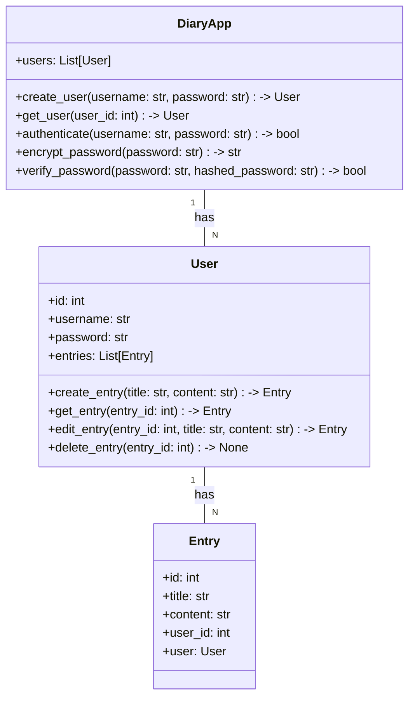
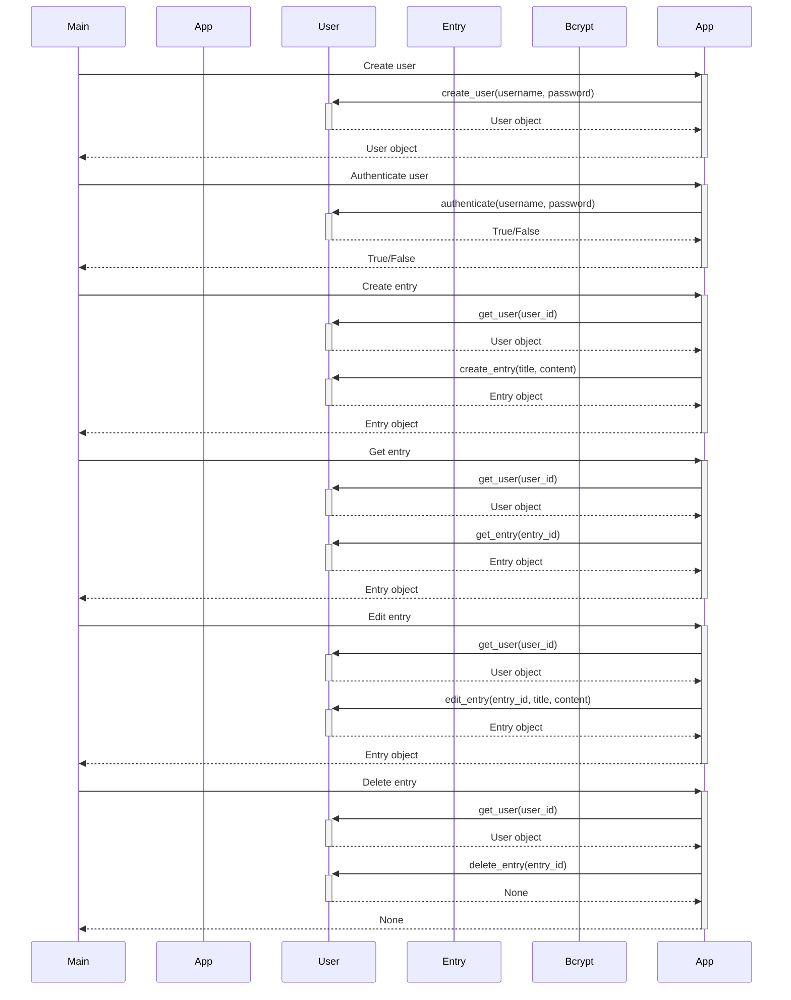

## Implementation approach:
To implement the diary app, we will use the Flask framework for the backend and HTML/CSS/JavaScript for the frontend. Flask is a lightweight and flexible web framework that allows us to quickly build web applications. We will also use SQLAlchemy as the ORM (Object-Relational Mapping) tool to interact with the database. For password encryption, we will use the bcrypt library.

## Python package name:
```python
"diary_app"
```

## File list:
```python
[
    "main.py",
    "models.py",
    "views.py",
    "templates/index.html",
    "templates/entry.html",
    "templates/edit.html",
    "templates/settings.html",
    "static/css/style.css",
    "static/js/script.js"
]
```

## Data structures and interface definitions:


## Program call flow:


## Anything UNCLEAR:
The requirements are clear to me.